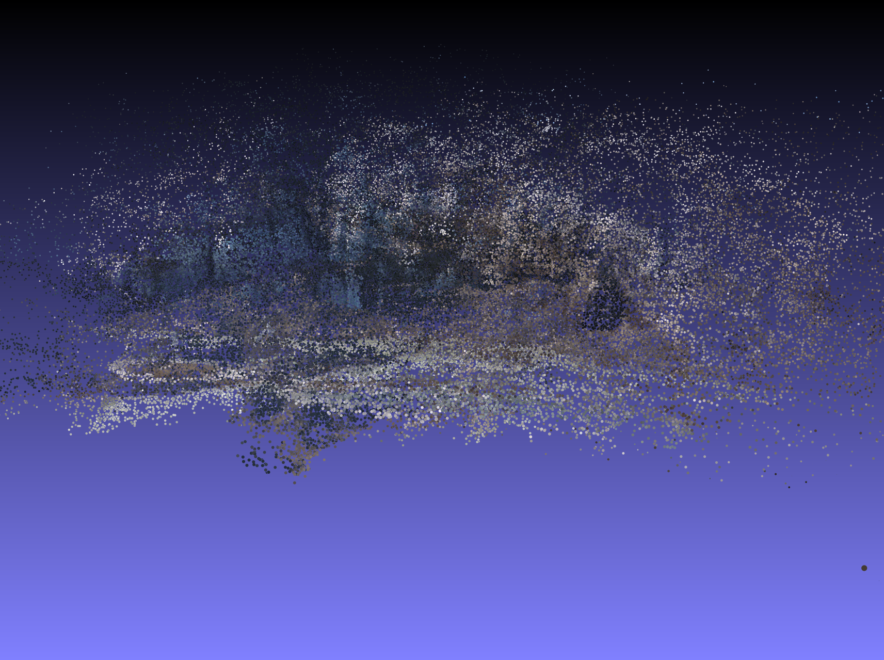
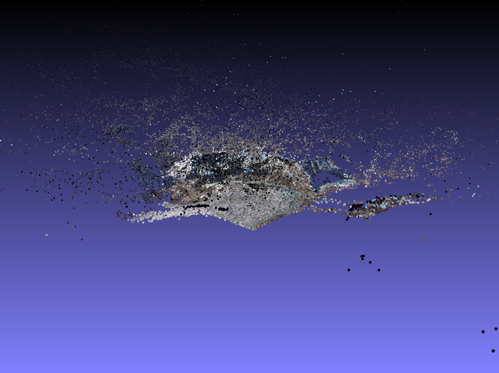
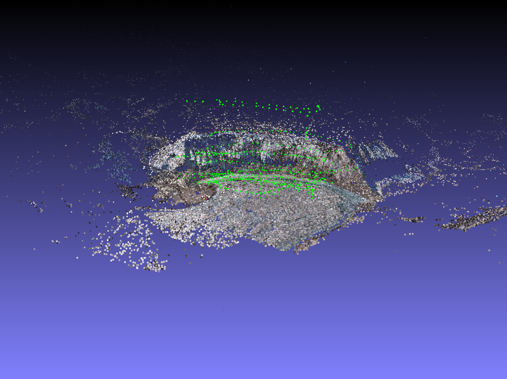

# A Comparative Study of Glacier 3d Reconstruction

[](#)
[](#)
[](#)





## 3D Glacier Reconstruction in Challenging Environments: A Comparative Study of Traditional and Deep Learning Approaches
sicheng.zhao@ucdconnect.ie, yuan.liang@ucdconnect.ie, abey.campbell@ucd.ie, soumyabrata.dev@ucd.ie
> Abstract: Accurate three-dimensional (3D) modelling of glacier surfaces is technically challenging due to specular reflections and weak texture. This paper presents a rigorous empirical comparison of two different Structure-from-Motion (SfM) pipelines—COLMAP and OpenMVG—and a recent deep learning based method ACEZero (ACE0), when confronted with such adverse imaging conditions. Using a high-resolution RGB images dataset representative of typical glacier scenes, we quantify reconstruction quality through point-cloud density, root-mean-square reprojection error (RMSE), and Chamfer distance to ground-truth geometry, while profiling computational efficiency in terms of run-time and hardware utilisation (CPU, GPU, RAM, VRAM). OpenMVG achieves the densest point cloud (1.48 M points) and the lowest RMSE (0.68 px), but suffers from substantial global shape deviation (Chamfer distance 429 px) and the longest execution time (7.2 h). ACEZero delivers an order-of-magnitude speed-up (0.8 h) with moderate GPU usage, yet reconstructs the fewest points (0.10 M) and exhibits the highest RMSE (3.58 px). COLMAP offers the most balanced performance, combining competitive density (0.52 M points), low Chamfer distance (28 px) and moderate resource demand (3.2 h). The results delineate clear trade-offs among accuracy, completeness and computational cost, furnishing practical guidance for selecting an appropriate pipeline under varying operational and hardware constraints.

---

## 🚀 Table of Contents

1. [About](#about)  
2. [Features](#features)  
3. [Getting Started](#getting-started)  
   - [Prerequisites](#prerequisites)  
   - [Installation](#installation)  
4. [Evaluation](#evaluation)  
5. [Authors & Acknowledgments](#authors--acknowledgments)  

---

## 📝 About

A few paragraphs describing the project:
- What problem does it solve?
- Who is it for?
- Any high-level design or tech choices worth calling out?

---

## ⚙️ Getting Started

### Prerequisites
- Linux
- CUDA
- CMake
- Git
- C/C++ compiler (GCC, Visual Studio or Clang)

### Installation

```bash
# install nessessary component
sh install.sh
```
Related Project:
- Ace0: is available at https://github.com/nianticlabs/acezero
- COLMAP: is available at https://colmap.github.io/
- OpenMVG: is available at https://github.com/openMVG/openMVG

### Dataset Download
Glacier dataset: is available at https://tls.unavco.org/projects/B-425/PS06/SV02/.

### Run the experiment
```bash
# activate env
conda activate ace0

# run experiment
./run_all.sh -i 30 -d '$Data_Path'
```
Note: "$Data_Path" should include *.JPG wildcard at the end, for example "/home/username/Dataset/.../JPG/\*.JPG"

### Evaluation
#### Chamfer Distance
```bash
python compute_chamfer.py \
  --source /path/to/ace0_trans.ply \
  --target /path/to/gt_gl.ply \
  --output losses.txt
```

```bash

```

# Authors--acknowledgments
SiCheng Zhao (sicheng.zhao@ucdconnect.ie) Ph.D. Scholar – University College Dublin  
Feel free to raise an issue for any question or data‐path tweak.